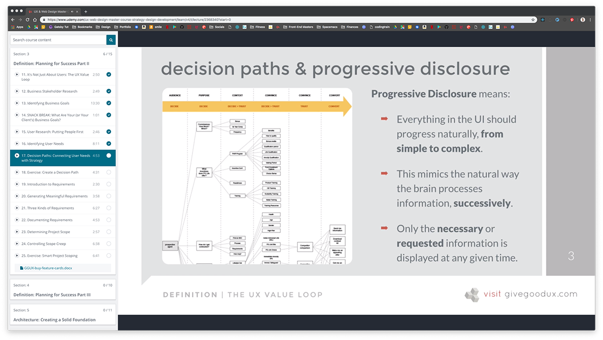

[Back to Course Outline](../course-outline.md)

# Section 1 Course Overview
- [Section 1 Course Overview](#section-1-course-overview)
    - [4 distinct phases](#4-distinct-phases)
  - [Sections 1-3](#sections-1-3)
    - [identifying user needs](#identifying-user-needs)
    - [Progressive Disclosure](#progressive-disclosure)
  - [Welcome: Get Ready to Define, Design and Code!](#welcome-get-ready-to-define-design-and-code)
  - [Download the BONUS 30-page Course Guidebook](#download-the-bonus-30-page-course-guidebook)
  - [Introduction to UX](#introduction-to-ux)

### 4 distinct phases  

- Definition = why are we doing this?
- Architecture = what content is needed?
- Design = what UI is appropriate?
- Development = how do we build it?

## Sections 1-3  

**User Research** (does not have to be formal, just ask questions)

Putting people first by asking:

- what they expect to do
- why that matters to them
- what other goals they have
- what other tools they use  

### identifying user needs

There are 2 general groups of app users: B2B and B2C  

**B2B:**

- ask what **process** they use not which **tools** they use.
- ask open-ended, non-leading questions
  - "what constitutes a good workday for you?"
  - "How do you go about doing _______?"
  - "how does this process compare with other orgs you've worked for?"
  - "what are the biggest probs, obstacles, or inefficiencies you deal with in this process?"
  - "can you tell me about any/all other systems, websites, or apps you use during the day?"

**B2C:**

- don't **solve** problems
- don't **suggest solutions**
- don't **give advice**
Patience is extremely important here; let the silence following the question do the heavy lifting and repress the urge to fill it with your own voice.
- "what task would you put off as long as you possibly can on a site like this?"
- "what things frustrate you most?"
- "how often do you use sites like this?"
- "what do you use them for most often?"
- "can you show me how you do that?"
- "what other things do you do before, during, or after you use the site?"
- "is ther a site that does something similar that you know of?"

Decision Paths:

- percieve need
- identify options
- narrow choices
- choose one
- service after sale

### Progressive Disclosure

The most important principle of good UI/UX is **progressive disclosure**.  
Information presented to someone who isn't _interested_ in it - or isn't ready to _process_ it - is **noise**.  

## Welcome: Get Ready to Define, Design and Code!

## Download the BONUS 30-page Course Guidebook

## Introduction to UX
