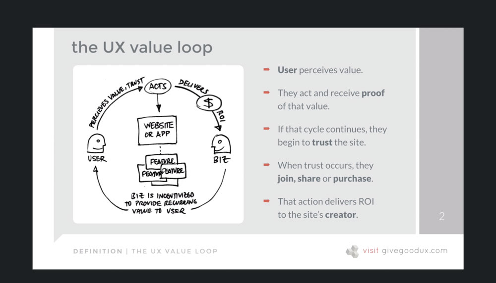

[Back to Course Outline](../README.md)  

# Section 2 - Definition: Planning for Success <!-- omit in toc -->

### Table of Contents:
- [4. Why Are We Doing This?](#4-why-are-we-doing-this)
  - [Definition - Planning for Success](#definition---planning-for-success)
- [5. Three Crucial Questions (You Must Ask)](#5-three-crucial-questions-you-must-ask)
- [6. What's Worth Doing?](#6-whats-worth-doing)
- [7. What Are We Creating?](#7-what-are-we-creating)
- [8. What Value Does It Provide?](#8-what-value-does-it-provide)
  - [Takeaways](#takeaways)
- [9. SNACK BREAK: Who Are Your Users?](#9-snack-break-who-are-your-users)
- [10. Exercise: Determining Value & Strategic Opportunity](#10-exercise-determining-value--strategic-opportunity)

# 4. Why Are We Doing This?

## Definition - Planning for Success

- Why are we doing this?
- Who are we doing it for?
- What value will it provide?
- How will we measure success?
- What can we realistically do?

[Table of Contents](#Table-of-Contents:)  

# 5. Three Crucial Questions (You Must Ask)

Websites are strategic. Have to know 3 things:

1. What worth doing?
2. What are we creating?
3. What value does it provide?

[Table of Contents](#Table-of-Contents:)  

# 6. What's Worth Doing?

Tradeoffs between **importance** and **feasibility** and **viability**  

(introduce gannt chart of *ignore*, *consider*, and *include or die*)

[Table of Contents](#Table-of-Contents:)  

# 7. What Are We Creating?

(image of what everyone _thought_ they were creating)

Each person's mental model of what the thing will be could be totally different (e.g. CEO, PO, Designer).  

It's YOUR job to get everyone on the same page.  

WRITE IT DOWN  
Doesnt' have to be formal, just do it and make it available.  
- features, 
- functionality, 
- platform, 
- content

[Table of Contents](#Table-of-Contents:)  

# 8. What Value Does It Provide?

- Who is our target audience?
- What experiences will be valuable or compelling to them?
- How will our offering be different from competitors?

## Takeaways

1. What worth doing?
2. What are we creating?
3. What value does it provide?

[Table of Contents](#Table-of-Contents:)  

# 9. SNACK BREAK: Who Are Your Users?

Identify User Needs:  
- Who are your users?
- What do they expect?
- Why do those things matter to them?

[Table of Contents](#Table-of-Contents:)  

# 10. Exercise: Determining Value & Strategic Opportunity

[Table of Contents](#Table-of-Contents:)  

[Back to Course Outline](../README.md)  

[< Section 1](../notes/notes-section-01.md) | [Section 3 >](../notes/notes-section-03.md)  