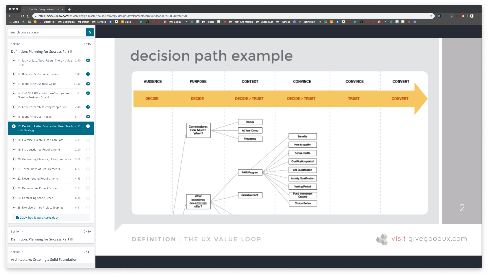
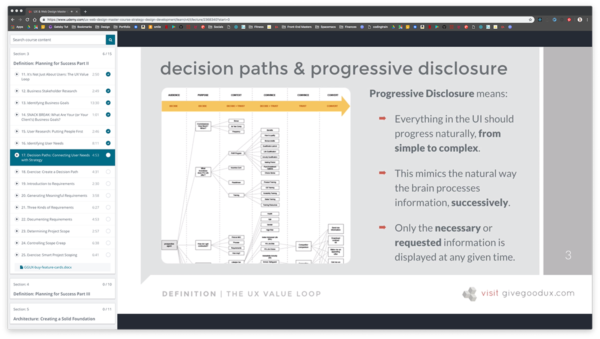

[Back to Course Outline](../course-outline.md)

# Section 3 Definition: Planning for Success Part II

- [Section 3 Definition: Planning for Success Part II](#section-3-definition-planning-for-success-part-ii)
- [11. It's Not Just About Users: The UX Value Loop](#11-its-not-just-about-users-the-ux-value-loop)
- [12. Business Stakeholder Research](#12-business-stakeholder-research)
- [13. Identifying Business Goals](#13-identifying-business-goals)
- [14. SNACK BREAK: What Are Your (or Your Client's) Business Goals?](#14-snack-break-what-are-your-or-your-clients-business-goals)
- [15. User Research: Putting People First](#15-user-research-putting-people-first)
- [16. Identifying User Needs](#16-identifying-user-needs)
- [17. Decision Paths: Connecting User Needs with Strategy](#17-decision-paths-connecting-user-needs-with-strategy)
- [18. Exercise: Create a Decision Path](#18-exercise-create-a-decision-path)
- [19. Introduction to Requirements](#19-introduction-to-requirements)
- [20. Generating Meaningful Requirements](#20-generating-meaningful-requirements)
- [21. Three Kinds of Requirements](#21-three-kinds-of-requirements)
- [22. Documenting Requirements](#22-documenting-requirements)
- [23. Determining Project Scope](#23-determining-project-scope)
- [24. Controlling Scope Creep](#24-controlling-scope-creep)
- [25. Exercise: Smart Project Scoping](#25-exercise-smart-project-scoping)
    - [identifying user needs](#identifying-user-needs)
    - [Progressive Disclosure](#progressive-disclosure)

# 11. It's Not Just About Users: The UX Value Loop
# 12. Business Stakeholder Research
# 13. Identifying Business Goals
# 14. SNACK BREAK: What Are Your (or Your Client's) Business Goals?
# 15. User Research: Putting People First
# 16. Identifying User Needs
# 17. Decision Paths: Connecting User Needs with Strategy
# 18. Exercise: Create a Decision Path
# 19. Introduction to Requirements
# 20. Generating Meaningful Requirements
# 21. Three Kinds of Requirements
# 22. Documenting Requirements
# 23. Determining Project Scope
# 24. Controlling Scope Creep
# 25. Exercise: Smart Project Scoping
  GGUX-buy-feature-cards.docx

**User Research** (does not have to be formal, just ask questions)

Putting people first by asking:

- what they expect to do
- why that matters to them
- what other goals they have
- what other tools they use  

### identifying user needs

There are 2 general groups of app users: B2B and B2C  

**B2B:**

- ask what **process** they use not which **tools** they use.
- ask open-ended, non-leading questions
  - "what constitutes a good workday for you?"
  - "How do you go about doing _______?"
  - "how does this process compare with other orgs you've worked for?"
  - "what are the biggest probs, obstacles, or inefficiencies you deal with in this process?"
  - "can you tell me about any/all other systems, websites, or apps you use during the day?"

**B2C:**

- don't **solve** problems
- don't **suggest solutions**
- don't **give advice**
Patience is extremely important here; let the silence following the question do the heavy lifting and repress the urge to fill it with your own voice.
- "what task would you put off as long as you possibly can on a site like this?"
- "what things frustrate you most?"
- "how often do you use sites like this?"
- "what do you use them for most often?"
- "can you show me how you do that?"
- "what other things do you do before, during, or after you use the site?"
- "is ther a site that does something similar that you know of?"

Decision Paths:

- percieve need
- identify options
- narrow choices
- choose one
- service after sale

### Progressive Disclosure

The most important principle of good UI/UX is **progressive disclosure**.  
Information presented to someone who isn't _interested_ in it - or isn't ready to _process_ it - is **noise**.  

[Back to Course Outline](../course-outline.md)  

[< Section 2](../notes/notes-section-02.md) | [Section 4 >](../notes/notes-section-04.md)  