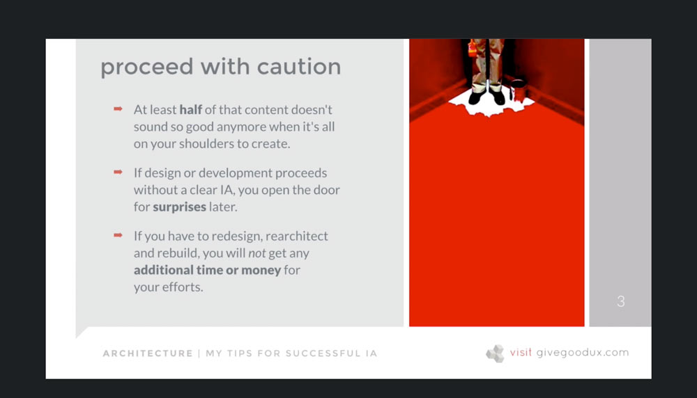
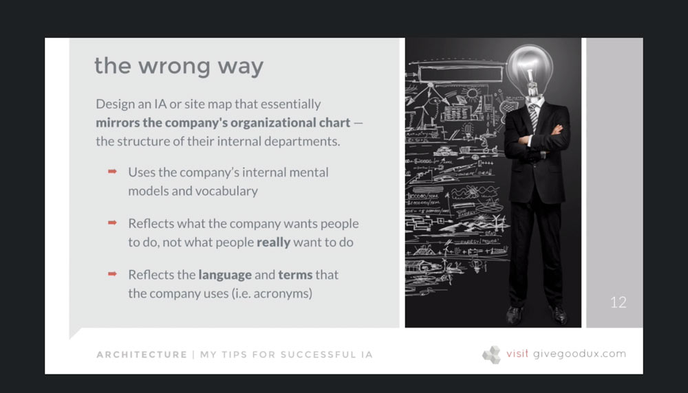
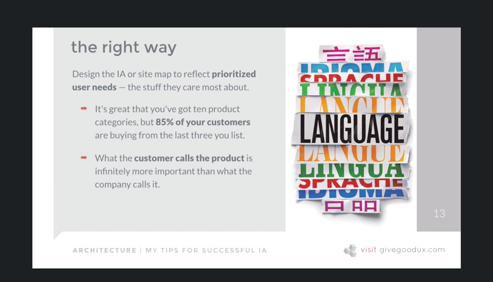
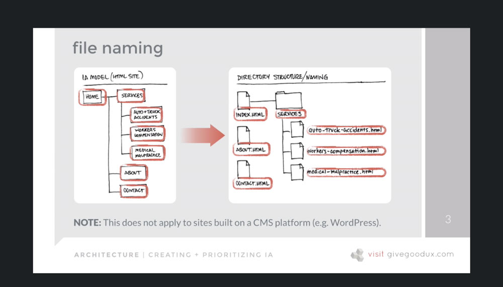
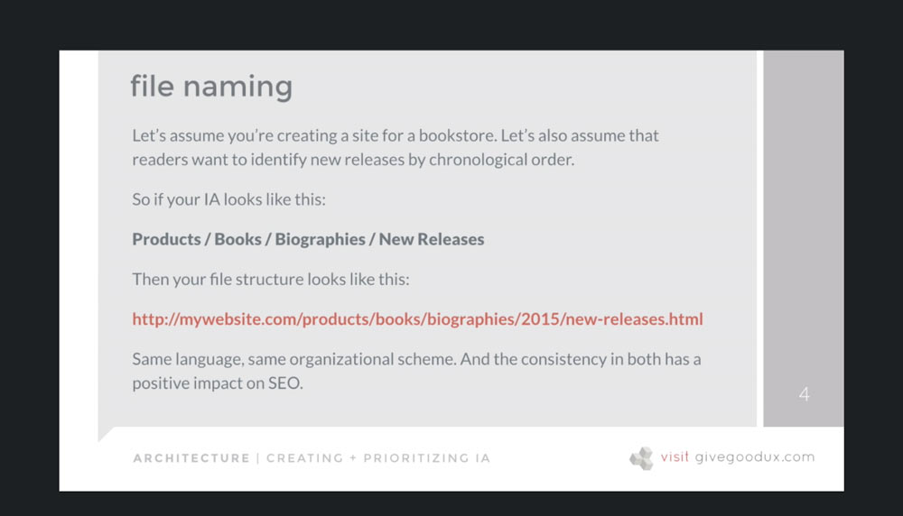
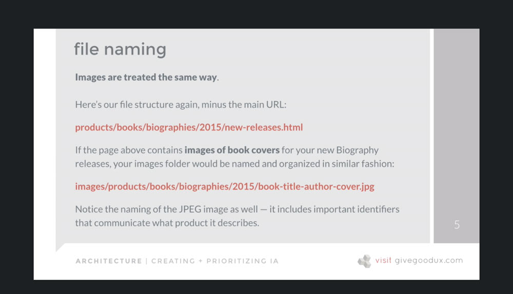
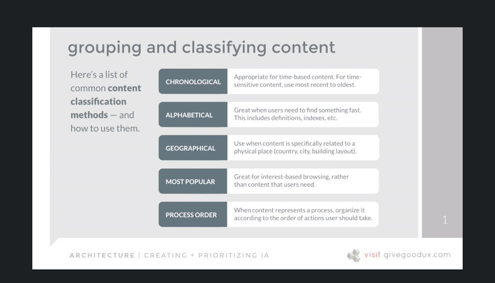
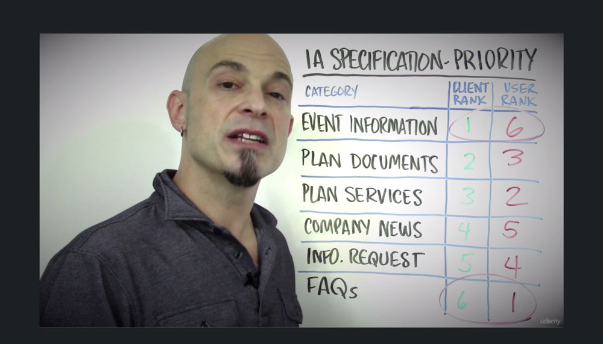

[Back to Course Outline](../README.md)  

[< Section 4](../notes/notes-section-04.md) | [Section 6 >](../notes/notes-section-06.md)  

# Section 5: Architecture: Creating a Solid Foundation <!-- omit in toc -->

### Table of Contents:  

- [36. Information Architecture: Organizing Content and Flow](#36-information-architecture-organizing-content-and-flow)
  - [4 Components (Rosenfeld and Morville)](#4-components-rosenfeld-and-morville)
- [37. What IS Information Architecture (IA)?](#37-what-is-information-architecture-ia)
  - [The Polar Bear Book by Rosenfeld and Morville](#the-polar-bear-book-by-rosenfeld-and-morville)
- [38. Content Strategy: Identifying, Organizing and Delivering](#38-content-strategy-identifying-organizing-and-delivering)
    - [Takeaway: Content has to be relevant, appropriate, and useful](#takeaway-content-has-to-be-relevant-appropriate-and-useful)
- [39. Determining Content Requirements](#39-determining-content-requirements)
  - [Questions to ask:](#questions-to-ask)
- [40. Exercise: Identifying Content Workflows](#40-exercise-identifying-content-workflows)
- [41. My Tips for Successful Information IA Modeling](#41-my-tips-for-successful-information-ia-modeling)
  - [Identify content and socialize IA early.](#identify-content-and-socialize-ia-early)
  - [Start with context of use](#start-with-context-of-use)
  - [5 States that affect context](#5-states-that-affect-context)
  - [IA must be user-centered](#ia-must-be-user-centered)
- [42. Creating and Prioritizing IA](#42-creating-and-prioritizing-ia)
  - [Categories and labeling](#categories-and-labeling)
- [43. Content Labeling](#43-content-labeling)
  - [Good labeling](#good-labeling)
  - [Choosing useful labels](#choosing-useful-labels)
- [44. File Naming](#44-file-naming)
- [45. Grouping and Classifying Content](#45-grouping-and-classifying-content)
  - [Most commoon content classification methods - and how to use them.](#most-commoon-content-classification-methods---and-how-to-use-them)
- [46. Exercise: Determining Information Priority](#46-exercise-determining-information-priority)

# 36. Information Architecture: Organizing Content and Flow

## 4 Components (Rosenfeld and Morville)

1) ***Organizational*** structure
2) ***Labeling*** systems
3) ***Navigation*** systems
4) ***Search*** systems  

[TOC](#Table-of-Contents)  

# 37. What IS Information Architecture (IA)?
IA means consciously organizing the content and flow of a website, app or system.  

That organization should be meaningful, which means it's based on what you know about the people using the site.  

In particular, what their **preconceptions** and **expectations** are.  

IA then, is based on: 

- how content will be organized
- what content will be called (labeling)
- what and how much they expect to find
- how they expect to be able to move through it
- how they expect to be able to view, enter, download,, manipulate, or interact with it

## [The Polar Bear Book by Rosenfeld and Morville](https://www.amazon.com/dp/1491911689/ref=cm_sw_em_r_mt_dp_U_4VWpCb4R4SJBD)
1) ***Organizational*** structure
2) ***Labeling*** systems
3) ***Navigation*** systems
4) ***Search*** systems  

IA isn't just relegated to websites (think about grocery stores or Target - wayfinding).

IA vs Site map?  

- IA is a strategy for categorizing, organizing, prioritizing, and linking content based on user expectations/needs and business goals.
- Site map is a visual representation that illustrates this strategy.

The site map shows site navigation and main content areas, along with the relationships between the pages on the site.  

[TOC](#Table-of-Contents)  

# 38. Content Strategy: Identifying, Organizing and Delivering
Content should always be strategically leveraged to serve a goal.

### Takeaway: Content has to be relevant, appropriate, and useful

**Relevant**
- is it relevant to our reason for being?
- reason people have come to our site?
- will they identify with it?
- will it encourage them to take the intended action?

**Appropriate**
- consitent with message everywhere else?
- consistent theme and tone of voice?
- style appropriate both for the business and audience? casual vs. formal?
- telling the truth

**Useful**
- useful, valuable, or meaningful or...
- happy talk? "we are a leading provider of blah, blah, blah..."
- is it all about you or them?
- is it answering their primary question: "what's in it for me?"  

[TOC](#Table-of-Contents)  

# 39. Determining Content Requirements  

## Questions to ask:

- Who's going to create content?  
- Who's going to edit and/or approve it?  
- Who's going to manage and update it?  
- What are our competitors doing?  
- Will people think this is useful and valuable?  
- How will they find all of this content?  
- How many different kinds of are there?  
- Where does this fit in our established IA?  
- How will we display all of this?  
- Are there form factor restrictions?  

[TOC](#Table-of-Contents)  

# 40. Exercise: Identifying Content Workflows

**1) Talk to content stakeholders**
- You ask questions, they answer. You diagram and ask additional questions as the conversation takes place.  
- Ask them to describe their current process for creating and publishing content.  
- Ask them what's working and what isn't.  
- Ask them which people - in what roles - are involved in content creatiion, editing, requesting, and approval.  

Diagram what you learn about their **roles**, **tasks**, and **relationships**  

  

**2) Define tasks and activities**
- Adding text, photos, video, Twitter feeds, forms, etc.
- Creating new pages
- Deleting pages and digital assets
- Adding or updating metadata
- Publishing content to a test server
- Returning new or edited content with comments for revisions
- Scheduling content for publication
- Formatting headers, tables, captions, links, etc.

**3) Diagram the process**

  

**4) Ask questions as you diagram**
- Can authors creat new pages or just edit existing ones?
- Who is authorized to create subfolders (subdirectories)?
- Can authors delete pages? What about other digital assets like photos, videos, etc.?
- Can editors approve content across the entire site or just the sections they're responsible for?
- What about content they own that spreads across multiple sections of the site?
- How dow we manage multiple approvers (editors)? Are requests for approval delegated to other approvers if an assigned editor is out of the office?
- How do we manage workflow when multiple authors are working on the same page? (GIT, checkout process, Google Docs).
- Are content managers involved in the work flow process? Are they informed about publishing updates? Are they repsonsible for dcoumenting changes in the system somewhere?

[TOC](#Table-of-Contents)  

# 41. My Tips for Successful Information IA Modeling
  

## Identify content and socialize IA early.
Every idea sounds great when **somebody else** is repsonsible for creating it.

## Start with context of use
The external factors that influence how people interact with your content, navigation and information structures.

## 5 States that affect context  
1) Physical
   - are they using a mobile device?
   - are they holdin it with both hands or one hand?
   - is that hand the left or right?
   - are they physically able to stay in one place and consume content?
   - are they performing other tasks at the same time?
2) Environmental
   - what's the room they're in like?
   - is it noisy? loud? crowded?
   - does someone interrupt them every 5 minutes while they're working?
   - are they curled up on the couch with a tablet?
   - are they viewing content on their phone as they're walking down the street?
3) Preferential
   - how do they prefer to access the content?
   - on what device - phone, laptop, desktop, or tablet?
   - do they prefer video or audio content instead of reading text onscreen?
   - are there learning disabilities or physical diabilities that should be considered?
4) Emotional
   - how is the person feeling? what's their stress level
   - what is motivating their activity?, their use of the website?
   - what do they want from you?
   - what can't they live without?
   - if they feel like they don't get what they need from you, is there consequence?
5) Cognitive
   - what ssumptions will they make based on what they read and interact with?
   - what's their ability to learn? does it take multiple tries or reads to understand?
   - is it suitable for all education or skill levels?
   - are we talking to a very narrow, well-defined group of people? or is this a mass market product with varying degrees of literacy, education, or ability?

## IA must be user-centered
it's purpose, stategy, form, and function should all revolve around user expectation.

  
  

[TOC](#Table-of-Contents)  

# 42. Creating and Prioritizing IA

## Categories and labeling

Need to address 2 things:
1) **Content** labeling and taxonomy
2) **File** (HTML) naming and taxonomy

[TOC](#Table-of-Contents)  

# 43. Content Labeling

## Good labeling  

Visitors have a **pre-existing mental model** of how the site works, how content is organized and what things will be called.  

Good labeling helps people quickly and accurately **predict** what they''ll get *before* the click or tap.  

The more **descriptive** the label, and the closer it is to what the **user would call it**, the higher the chance they'll interact with it.  

On every screen, the user has to review and compare what's available to them and decide which one is the **right one**. That procss often happens in seconds, but it can be exhausting.  

Being wrong causes both **fatigue** and **frustration**, which causes people to leave the site and look for one that's more clearly labeled.  

Clients will often default to **industry terminology**, acronyms and jargon, because it's second nature to them.  

It's your job to guide your client - by asking some very simple questions about category, subcategory, link, and call-to-action labeling:

- "Is that what your customers would call it?"
- "What catgory would users expect to find that in?"
- "What's the action they're actually taking when they click this button?" 

## Choosing useful labels  

- **Choose clear, descriptive words and phrases.** Strive for simplicity, accuracy, and clarity.  
- **Don't make up words or terms.** Don't be clever; stick to commonly used terms.  
- **Don't overlap categories.** Category labels should be distinct and descriptive.  
- **Make sure your organizational scheme makes sense to users.** No model numbers.  
- **Don't rely on your own opionions.** Test!  

[TOC](#Table-of-Contents)  

# 44. File Naming

Consistency between your IA and your file structure give you and/or your team a **map** for where everything goes and what it's called.  

File and directory naming should follow the **same scheme** you've set for category naming.  

Your scheme should be equally as **obvious**, and it should line up directly with the IA in terms of categories, subcategories, and labels. 

**File names should match IA Category labels.**  
this give everyone a shared understanding of where content lives and what it's called.  

  
  
  

[TOC](#Table-of-Contents)  

# 45. Grouping and Classifying Content

## Most commoon content classification methods - and how to use them.  

- Chronological
- Alphabetical
- Geographical
- Most Popular
- Process Order

  

[TOC](#Table-of-Contents)  

# 46. Exercise: Determining Information Priority

After asking client and actual users separately what was most important...

  

[Back to Course Outline](../README.md)  

[< Section 4](../notes/notes-section-04.md) | [Section 6 >](../notes/notes-section-06.md)  
