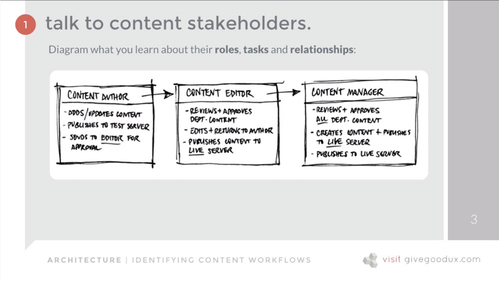
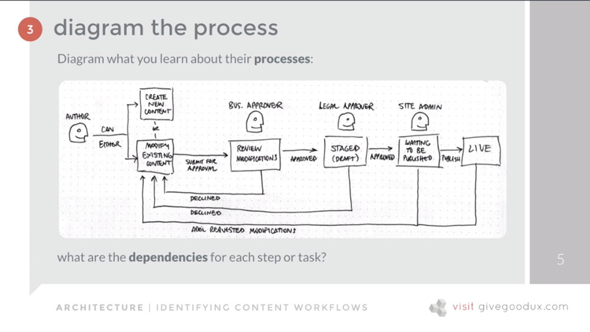

[Back to Course Outline](../README.md)  

[< Section 4](../notes/notes-section-04.md) | [Section 6 >](../notes/notes-section-06.md)  

# Section 5: Architecture: Creating a Solid Foundation <!-- omit in toc -->

### Table of Contents:  

- [36. Information Architecture: Organizing Content and Flow](#36-information-architecture-organizing-content-and-flow)
- [37. What IS Information Architecture (IA)?](#37-what-is-information-architecture-ia)
- [38. Content Strategy: Identifying, Organizing and Delivering](#38-content-strategy-identifying-organizing-and-delivering)
- [39. Determining Content Requirements](#39-determining-content-requirements)
- [40. Exercise: Identifying Content Workflows](#40-exercise-identifying-content-workflows)
- [41. My Tips for Successful Information IA Modeling](#41-my-tips-for-successful-information-ia-modeling)
- [42. Creating and Prioritizing IA](#42-creating-and-prioritizing-ia)
- [43. Content Labeling](#43-content-labeling)
- [44. File Naming](#44-file-naming)
- [45. Grouping and Classifying Content](#45-grouping-and-classifying-content)
- [46. Exercise: Determining Information Priority](#46-exercise-determining-information-priority)

## 36. Information Architecture: Organizing Content and Flow
4 Components (Rosenfeld and Morville)
1) Organizational structure
2) Labeling systems
3) Navigation systems
4) Search systems  

## 37. What IS Information Architecture (IA)?
IA means consciously organizing the content and flow of a website, app or system.  
That organization should be meaningful, which means it's based on what you know about the people using the site.  
In particular, what their **preconceptions** and **expectations** are.  

IA then, is based on: 
- how content will be organized
- what content will be called (labeling)
- what and how much they expect to find
- how they expect to be able to move through it
- how they expect to be able to view, enter, download,, manipulate, or interact with it

[The Polar Bear Book by Rosenfeld and Morville](https://www.amazon.com/dp/1491911689/ref=cm_sw_em_r_mt_dp_U_4VWpCb4R4SJBD)
1) Organizational structure
2) Labeling systems
3) Navigation systems
4) Search systems

IA isn't just relegated to websites. Think about grocery stores or Target

IA vs Site map?
IA is a strategy for categorizing, organizing, prioritizing, and linking content based on user expectations/needs and business goals.
Site map is a visual representation that illustrates this strategy.

## 38. Content Strategy: Identifying, Organizing and Delivering
Content should always be strategically leveraged to serve a goal.

Takeaway:
Content has to be relevant, appropriate, and useful

**Relevant**
- is it relevant to our reason for being?
- reason people have come to our site?
- will they identify with it?
- will it encourage them to take the intended action?

**Appropriate**
- consitent with message everywhere else?
- consistent theme and tone of voice?
- style appropriate both for the business and audience? casual vs. formal?
- telling the truth

**Useful**
- useful, valuable, or meaningful
- happy talk? "we are a leading provider of blah, blah, blah..."
- is it all about you or them?
- is it answering the question: "what's in it for me?"

## 39. Determining Content Requirements
Who's going to create content?  
Who's going to edit and/or approve it?  
Who's going to manage and update it?  
What are our competitors doing?  
Will people think this is useful and valuable?  
How will they find all of this content?  
How many different kinds of are there?  
Where does this fit in our established IA?  
How will we display all of this?  
Are there form factor restrictions?  

## 40. Exercise: Identifying Content Workflows
1) Talk to content stakeholders
   - You ask questions, they answer. You diagram and ask additional questions as the conversation takes place.  
   - Ask them to describe their current process for creating and publishing content.  
   - Ask them what's working and what isn't.  
   - Ask them which people - in what roles - are involved in content creatiion, editing, and approval.  

  

2) Define tasks and activities
   - Adding text, photos, video, Twitter feeds, forms, etc.
   - Creating new pages
   - Deleting pages and digital assets
   - Adding or updating metadata
   - Publishing content to a test server
   - Returning new or edited content with comments for revisions
   - Scheduling content for publication
   - Formatting headers, tables, captions, links, etc.

3) Diagram the process  
  

4) Ask questions as you diagram  
  - Can authors creat new pages or just edit existing ones?
  - Who is authorized to create subfolders (subdirectories)?
  - Can authors delete pages? What about other digital assets like photos, videos, etc.?
  - Can editors approve content across the entire site or just the sections they're responsible for?
  - What about content they own that spreads across multiple sections of the site?  
  - How dow we manage multiple approvers (editors)? Are requests for approval delegated to other approvers if an assigned editor is out of the office?
  - How do we manage workflow when multiple authors are working on the same page? (GIT, checkout process, Google Docs).
  - Are content managers involved in the work flow process? Are they informed about publishing updates? Are they repsonsible for dcoumenting changes in the system somewhere?

## 41. My Tips for Successful Information IA Modeling

## 42. Creating and Prioritizing IA

## 43. Content Labeling

## 44. File Naming

## 45. Grouping and Classifying Content

## 46. Exercise: Determining Information Priority

[Back to Course Outline](../README.md)  

[< Section 4](../notes/notes-section-04.md) | [Section 6 >](../notes/notes-section-06.md)  
