[Back to Course Outline](../README.md)  

[< Section 5](../notes/notes-section-05.md) | [Section 7 >](../notes/notes-section-07.md)  

# Section 6: Architecture: Creating a Solid Foundation Part II <!-- omit in toc -->

### Table of Contents:  

- [47. Exercise: Turning Information Priority into an IA Model](#47-exercise-turning-information-priority-into-an-ia-model)
- [48. IA Models: Which One's Right for My Site?](#48-ia-models-which-ones-right-for-my-site)
- [49. Hierarchical Tree IA Model](#49-hierarchical-tree-ia-model)
- [50. Nested List IA Model](#50-nested-list-ia-model)
- [51. Hub and Spoke IA Model](#51-hub-and-spoke-ia-model)
- [52. Bento Box IA Model](#52-bento-box-ia-model)
- [53. Filtered View IA Model](#53-filtered-view-ia-model)
- [54. Combining IA Models](#54-combining-ia-models)
- [55. Tools for Creating IA Models](#55-tools-for-creating-ia-models)
- [56. Socializing and Validating Your IA Model](#56-socializing-and-validating-your-ia-model)
  - [Tree testing](#tree-testing)
    - [Takeaway:](#takeaway)
    - [1) model site structure on index cards](#1-model-site-structure-on-index-cards)
    - [2) give participants "find it" scenarios](#2-give-participants-%22find-it%22-scenarios)
    - [3) record activity during session](#3-record-activity-during-session)
    - [Benefits:](#benefits)
- [57. SNACK BREAK: Create an IA Model for Your Website](#57-snack-break-create-an-ia-model-for-your-website)

# 47. Exercise: Turning Information Priority into an IA Model  

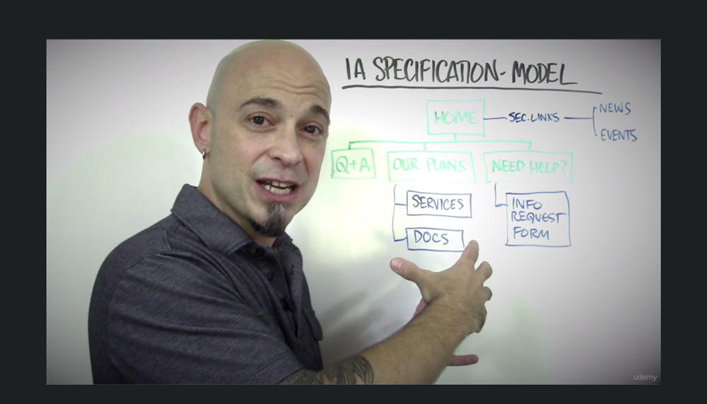  

[TOC](#Table-of-Contents)  

# 48. IA Models: Which One's Right for My Site?  

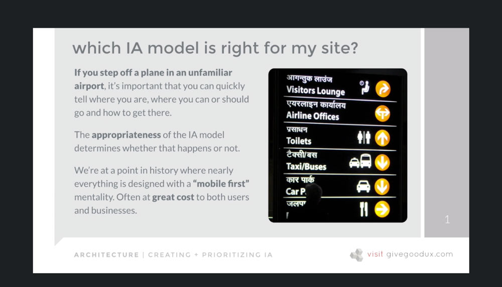  
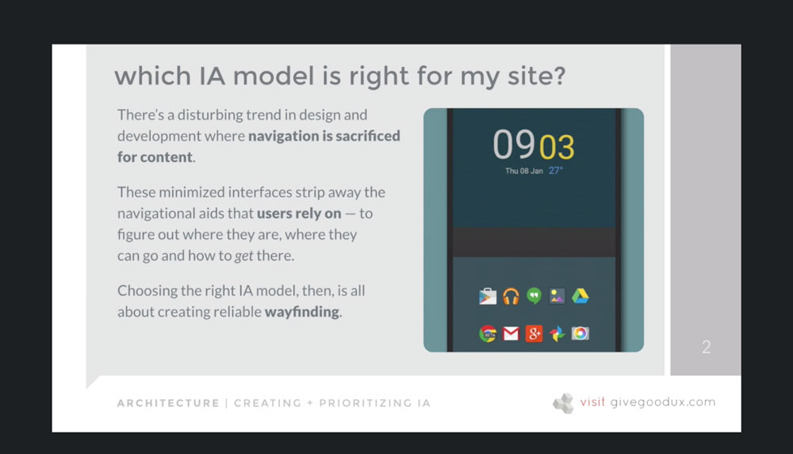  

[TOC](#Table-of-Contents)  

# 49. Hierarchical Tree IA Model  

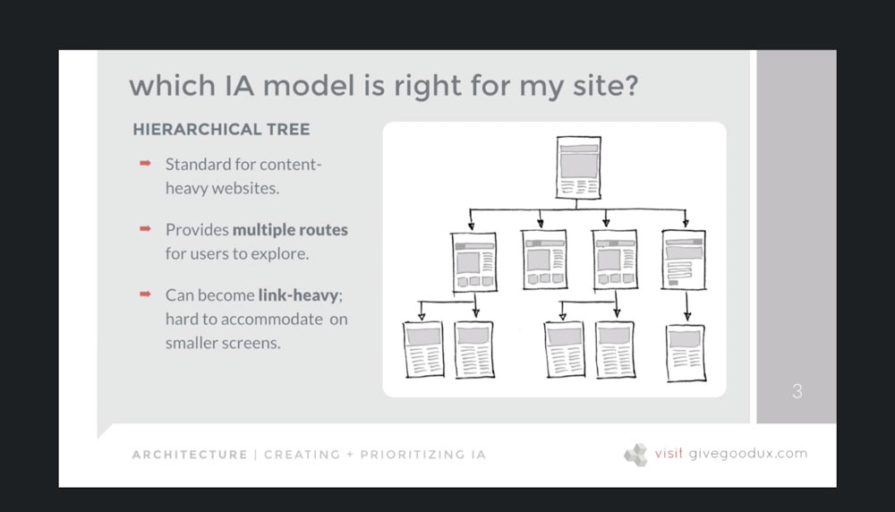  

[TOC](#Table-of-Contents)  

# 50. Nested List IA Model  

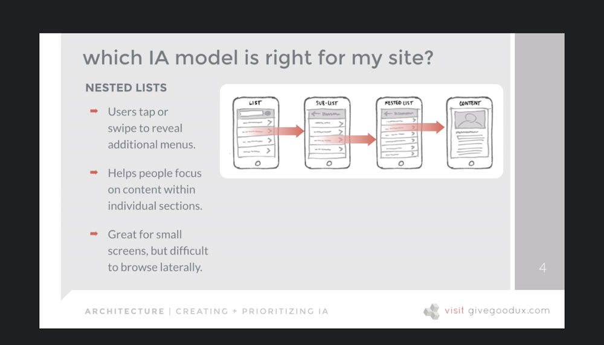  

[TOC](#Table-of-Contents)  

# 51. Hub and Spoke IA Model  

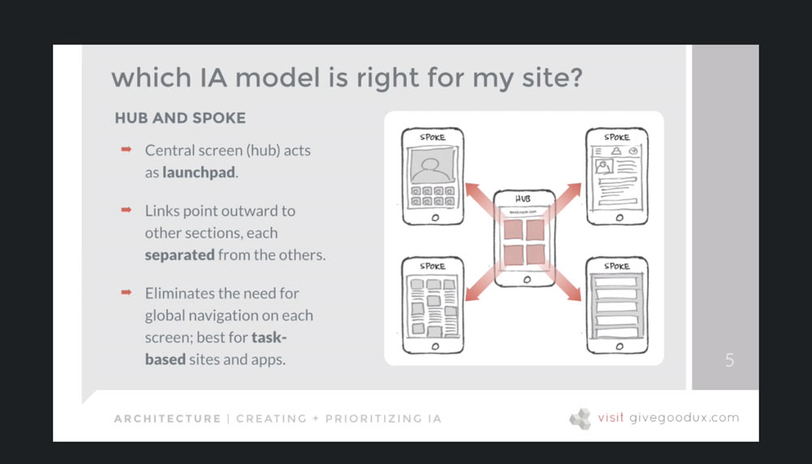  

[TOC](#Table-of-Contents)  

# 52. Bento Box IA Model  

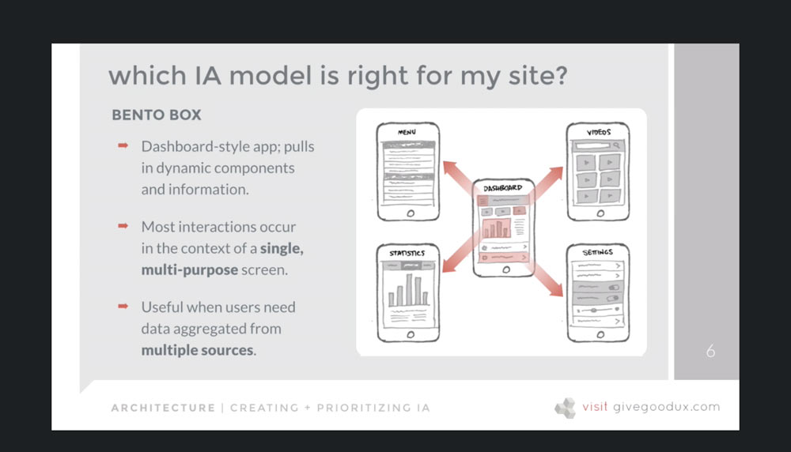  

[TOC](#Table-of-Contents)  

# 53. Filtered View IA Model  

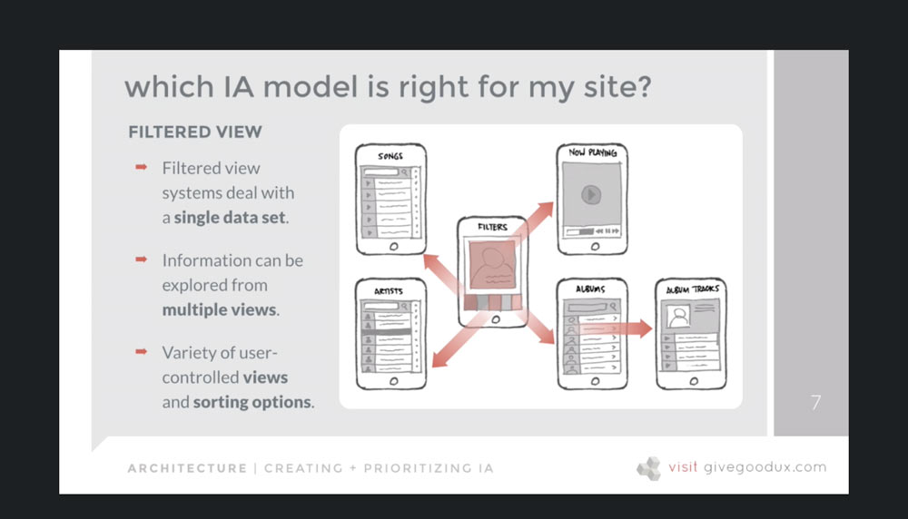  

[TOC](#Table-of-Contents)  

# 54. Combining IA Models  

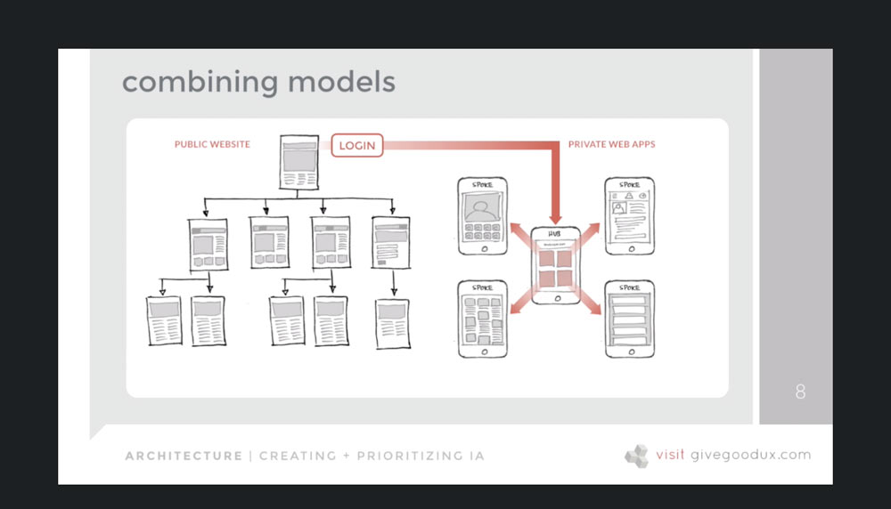  

[TOC](#Table-of-Contents)  

# 55. Tools for Creating IA Models  

- Use what is available, don't obsess over tools.
- Microsoft Word outline (small sites)
- Visio, OmniGraffle, Xmind

[TOC](#Table-of-Contents)  

# 56. Socializing and Validating Your IA Model  

## Tree testing

- similar to card sorting but sort cards into predefined "bucket" categories.
- if there is agreement about which cards go in which buckets, then those buckets should perform well in the IA.
- ***BUT*** while closed card sorting mimics how users may file a particular item of content, it doesn't necessarily model how users find information in a website or system.  

### Takeaway:  

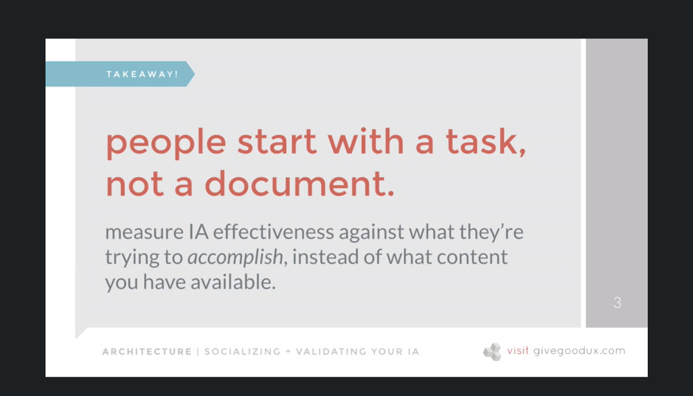  

### 1) model site structure on index cards

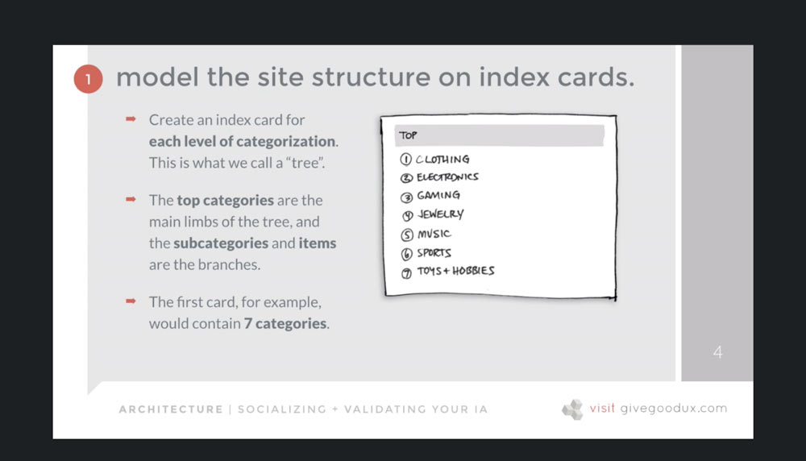  
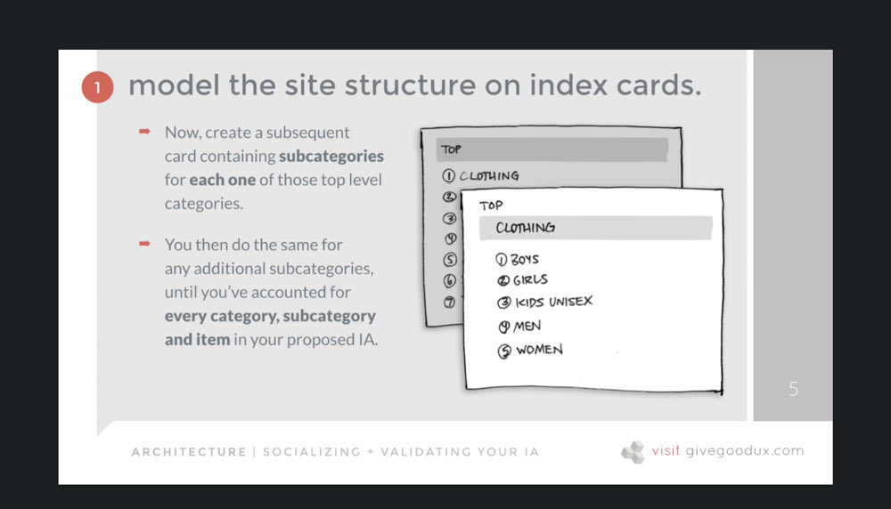  

### 2) give participants "find it" scenarios

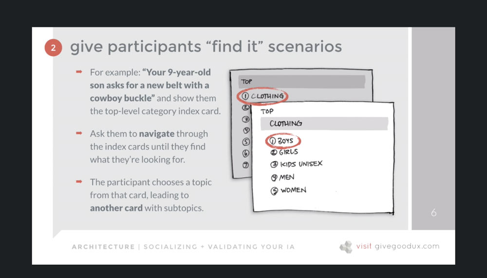  
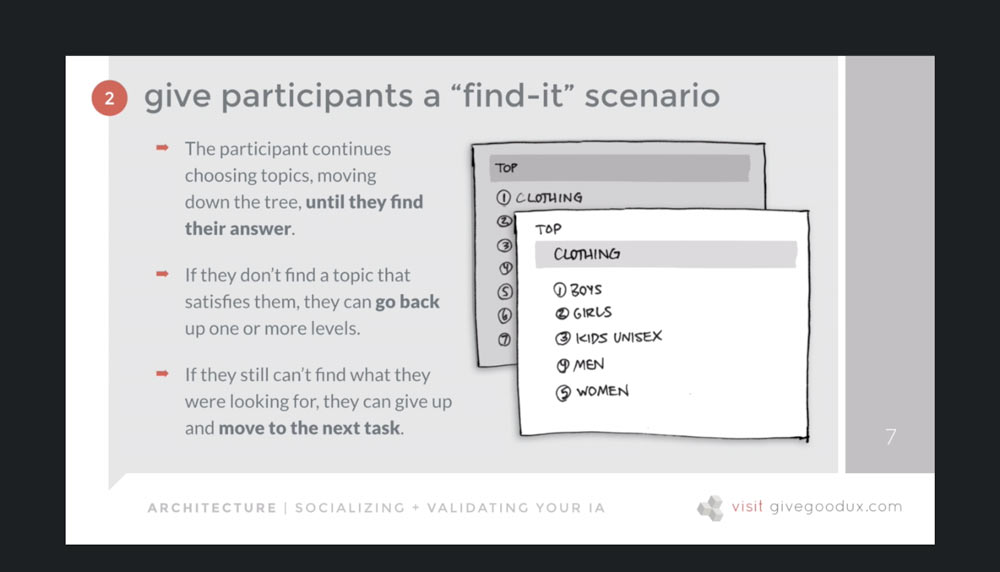  

### 3) record activity during session

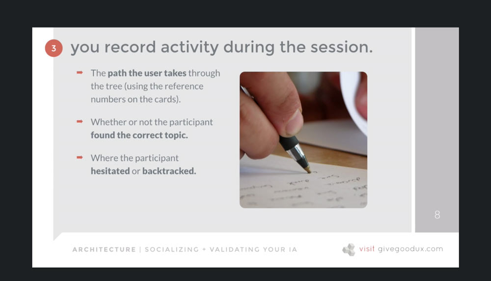  

### Benefits:

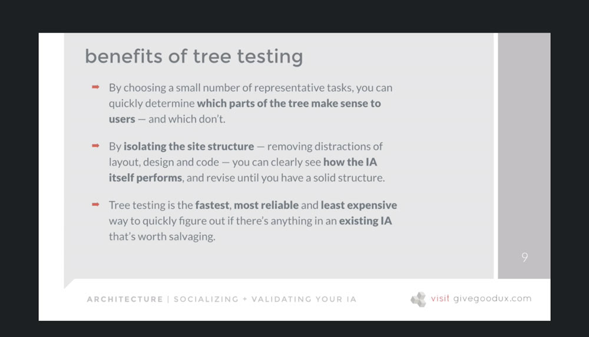  

[TOC](#Table-of-Contents)  

# 57. SNACK BREAK: Create an IA Model for Your Website  

[TOC](#Table-of-Contents)  

[Back to Course Outline](../README.md)  

[< Section 5](../notes/notes-section-05.md) | [Section 7 >](../notes/notes-section-07.md)  
