[Back to Course Outline](../README.md)  

[< Section 6](../notes/notes-section-06.md) | [Section 8 >](../notes/notes-section-08.md)  

# Section 7: Architecture: Creating a Solid Foundation Part III  <!-- omit in toc -->

### Table of Contents:  

- [58. Navigation Design](#58-navigation-design)
- [59. Primary and Secondary Navigation](#59-primary-and-secondary-navigation)
- [60. Global and Local Navigation](#60-global-and-local-navigation)
  - [Global navigation](#global-navigation)
  - [Local navigation](#local-navigation)
- [61. Navigation for Different User Types](#61-navigation-for-different-user-types)
- [62. Validating Your Navigation Scheme](#62-validating-your-navigation-scheme)
  - [Increasing information scent](#increasing-information-scent)
  - [Passing the "trunk test" - Steve Krug, _Don't Make Me Think_](#passing-the-%22trunk-test%22---steve-krug-dont-make-me-think)
- [63. Exercise: Determining Key Navigation Paths](#63-exercise-determining-key-navigation-paths)
- [64. Wireframing 101](#64-wireframing-101)
- [65. What a Wireframe ISN'T](#65-what-a-wireframe-isnt)
- [66. What a Wireframe IS](#66-what-a-wireframe-is)
  - [A wireframe IS...](#a-wireframe-is)
  - [Who uses wireframes?](#who-uses-wireframes)
  - [Examples:](#examples)
- [67. My Tips for Creating Successful Wireframe Prototypes](#67-my-tips-for-creating-successful-wireframe-prototypes)
- [68. Creating Wireframes: Tools of the Trade](#68-creating-wireframes-tools-of-the-trade)
- [69. SNACK BREAK: Try Creating a Basic Wireframe on Your Own](#69-snack-break-try-creating-a-basic-wireframe-on-your-own)
- [70. Exercise: Creating a B2B Wireframe with Axure RP Pro](#70-exercise-creating-a-b2b-wireframe-with-axure-rp-pro)
- [71. Socializing and Validating Wireframes](#71-socializing-and-validating-wireframes)
  - [Who to share it with](#who-to-share-it-with)
  - [Get stakeholder approval](#get-stakeholder-approval)
  - [Schedule a review](#schedule-a-review)
- [72. Architecture Takeaways: Things to Remember](#72-architecture-takeaways-things-to-remember)
  - [Takeaways:](#takeaways)

# 58. Navigation Design  

Introduction: Getting from here to there and back again

[TOC](#Table-of-Contents)  

# 59. Primary and Secondary Navigation  

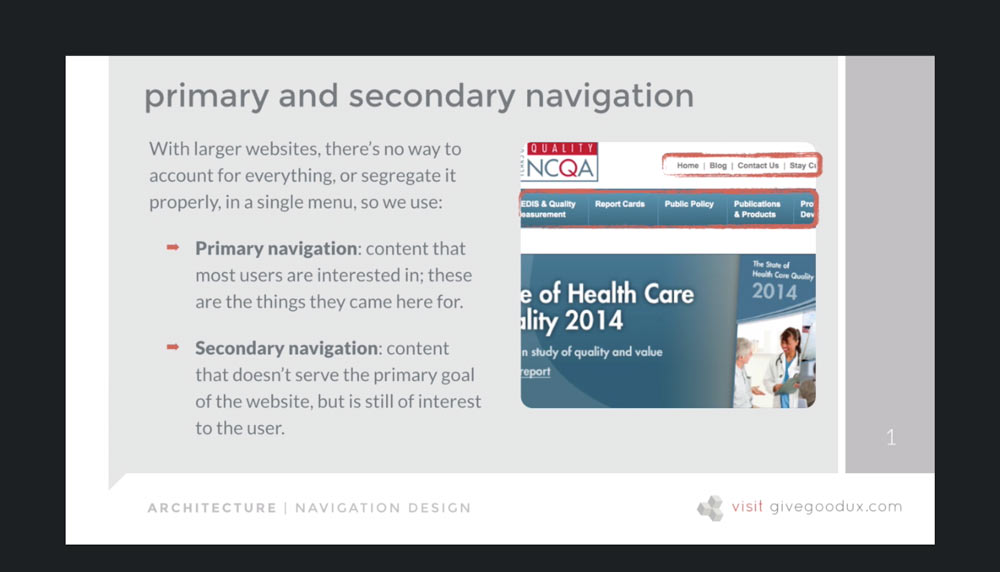  
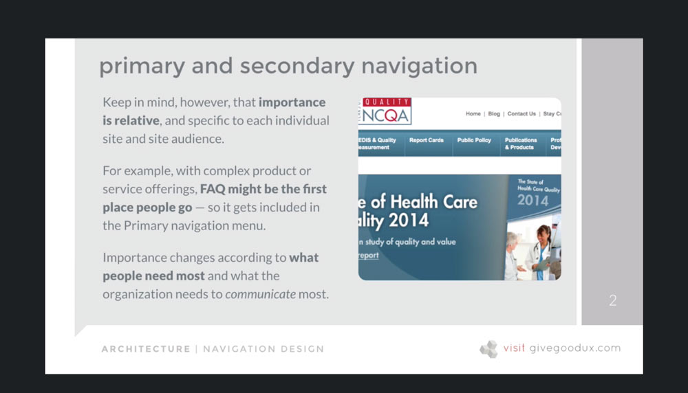  

[TOC](#Table-of-Contents)  

# 60. Global and Local Navigation  

## Global navigation
  

## Local navigation
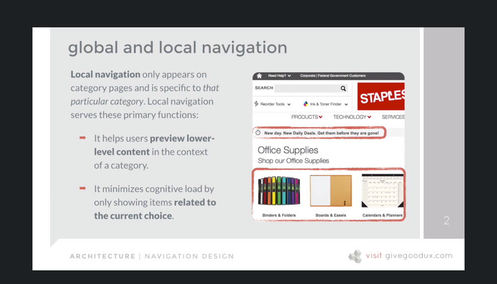  

[TOC](#Table-of-Contents)  

# 61. Navigation for Different User Types  

Logged out  

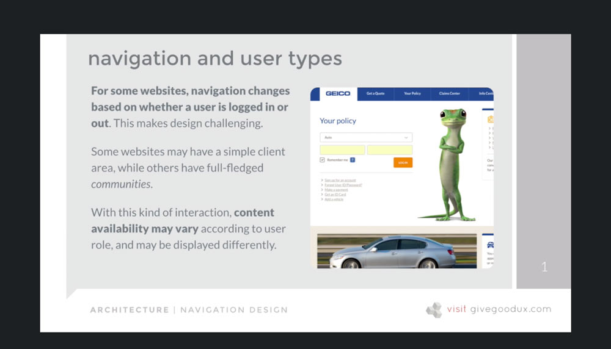  

Logged in  

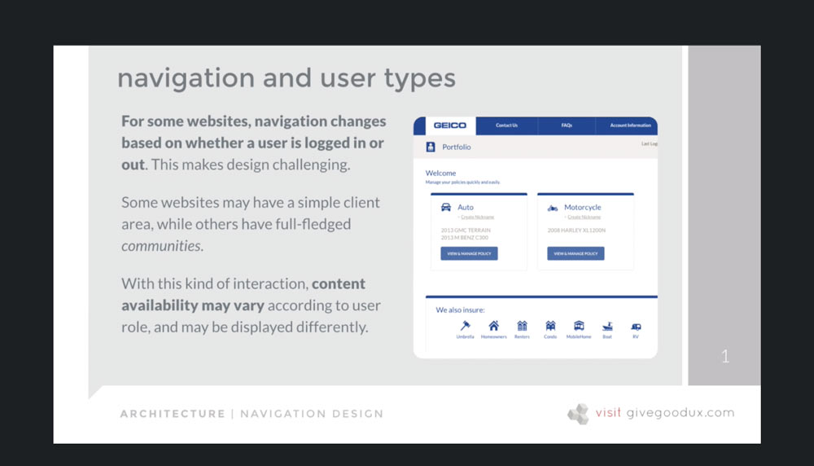  

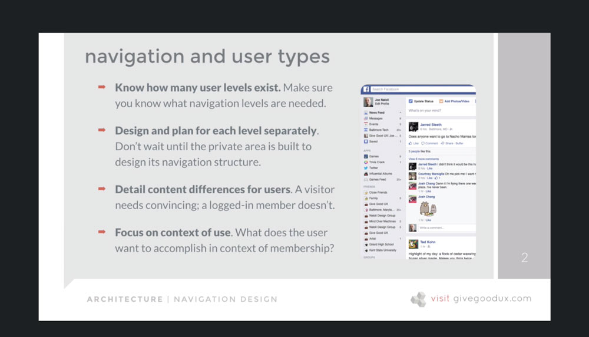  

- know how many user levels exist
- design and plan for each level separately
- detail content differences for users
- focus on context of use

[TOC](#Table-of-Contents)  

# 62. Validating Your Navigation Scheme  

## Increasing information scent
Considering how strong **information scent** is at any given point of the user's journey is a great way to validate you navigation approach.
- customer estimates, based on what she sees first, how much useful info she's likely to find on any given path.
- next, after she goes down the path, she compares what actually happened with what she expected (and predicted) to happen.

## Passing the "trunk test" - Steve Krug, _Don't Make Me Think_  
If blindfolded, dumped in a trunk, driven around the city and then dumped out, could you find your way back?

- Where am I?
- How did I get here?
- What can I do here?
- Where can I go from here?

...if yes, your navigation:
- Provides a strong sense of place.
- Sets correct expectations.
- Allows user to accurately predict the outcome of interactions.

[TOC](#Table-of-Contents)  

# 63. Exercise: Determining Key Navigation Paths  

1) Identify valuable outcomes
  - what's the value proposition?
  - What do users want to happen, and what do _you_ want to happen?
  - How many valuable outcomes exist, and how important is each?
2) Identify direct paths to value.
  - is the path to that value obvious?
  - does that path also answer questions?

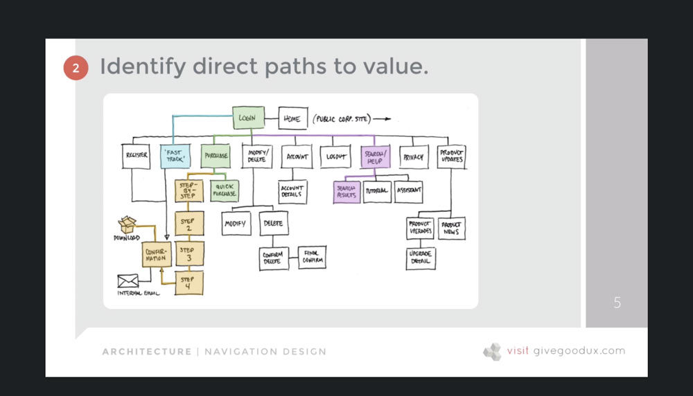  

3) Expose those paths in UI design.

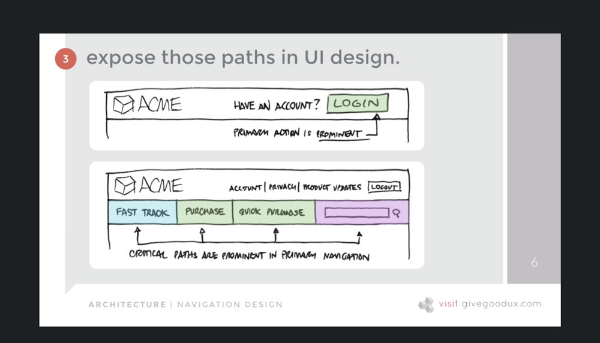  

Takeaway: make the path(s) to value **obvious and clear** in your navigation.

[TOC](#Table-of-Contents)  

# 64. Wireframing 101  

Wireframes represent:  
- information proiority and the organization of onscreen elements.
- labeling and categorization across pages and content
- basic layout and organization of each page
- how the various wayfinding mechanisms (menus, links, search, etc.) work
- how people will interact with what's being presented, and how the site responds

[TOC](#Table-of-Contents)  

# 65. What a Wireframe ISN'T  

A wireframe is NOT:

- **An actual UI design.** Wireframes show how the site works, not how it will look No images, colors, or fonts.
- **A guess at content.** Whenever possible, use real text for client approval.
- **A drawing.** While it may be visual, the work being done here is _thinking_.
- **A "quick sketch."** Every element of every page has to be labeled and described.

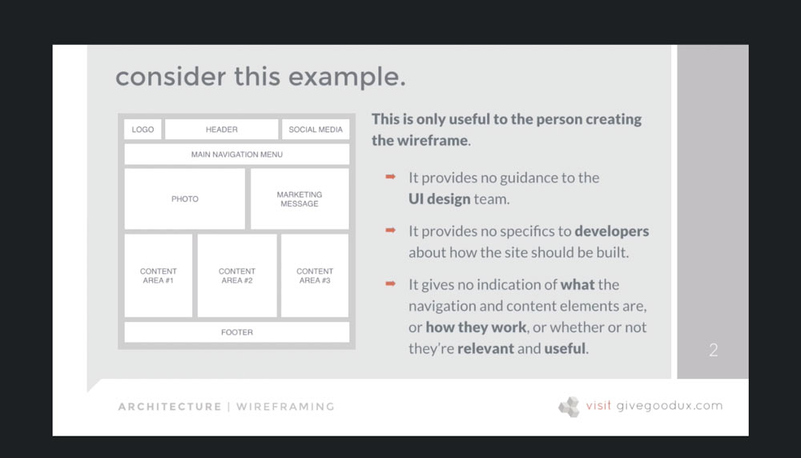  
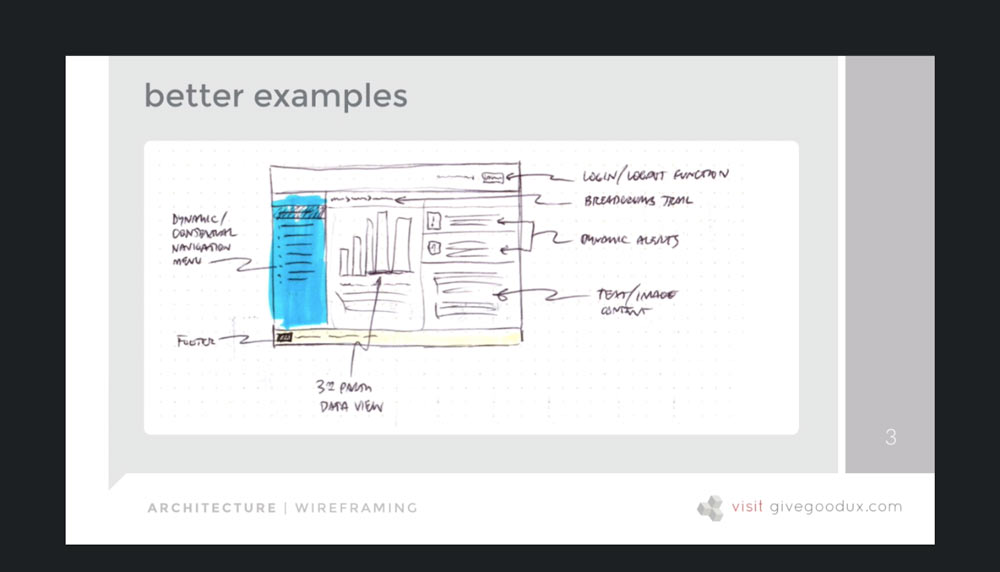  
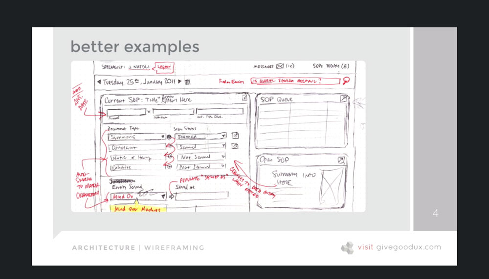  

Takeaway: talk to developers before you wireframe. Socialize sketches to test the feasibility of your intended interactions, features, and functionality.

[TOC](#Table-of-Contents)  

# 66. What a Wireframe IS  

## A wireframe IS...

A blueprint for design and development. It connects IA to visual design and validates the strength of the user experience:  
- **Structure:** How will the site be build?
- **Content:** What will be displayed?
- **Information hierarchy:** How is this info organized and displayed?
- **Functionality:** How will this work?
- **Behavior:** How do users interact with it?

## Who uses wireframes?  
- **UX Designers** and **Information Architects** use wireframes to design user flows.
- **UI Designers** use wireframes to think through and show the visual hierarchy of onscreen elements.
- **Developers** use wireframes to get a clear idea of the site's intended functionality.
- **Clients** and **Project/Product Managers** use wireframes to gain a clear udnerstanding of the site as a whole.

## Examples:  

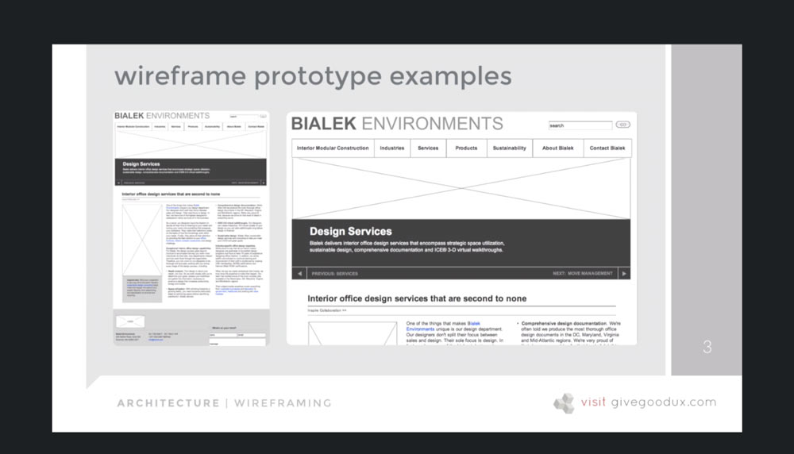  
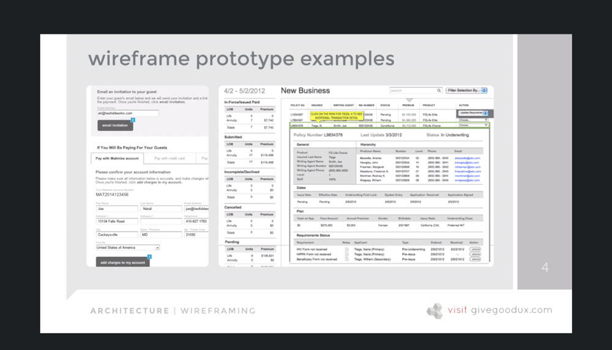  
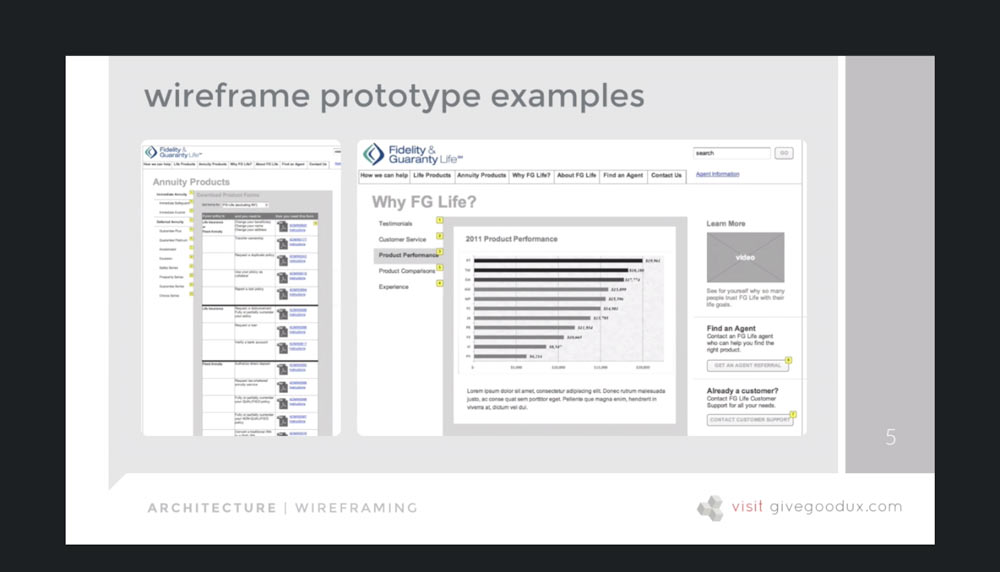  

[TOC](#Table-of-Contents)  

# 67. My Tips for Creating Successful Wireframe Prototypes  

1) Start with sketches - you'll be tempted to skip - don't. I fyou start with software, the tool will influence and constrain your decisions.
   1) Get **several** quick ideas of what these screens should or could look like.
   2) **Dont' stop to judge or analyze.** Just go.
   3) The minute it starts to feel like **you're overworking it**, move on. Two min max.
   4) **Do as many as you possibly can**, (20-25) and then reevaluate later.

2) Keep the UI generic
   1) **All fonts are Arial.** Use bold and italics to differentiate headlines from content.
   2) **All elements are shades of grey or solid black.** Darker shades indicate higher visual priority, ,ligher shades indicate lower.
   3) **Use blue to call out text hyperlinks.** You and the client need to be able to quickly tell where these exist and text them.
   4) **No images.** Indicate these with empty boxes with the lable [IMAGE] in the center.

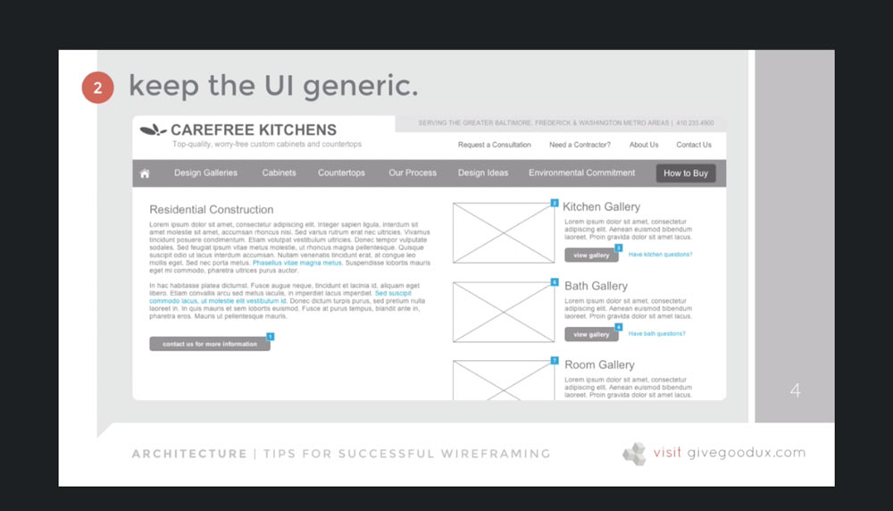  

3) Use real layout specs.
   1) This is the time to be thinking about what fits on screen at **various resolutions**.
   2) **Decide on a grid** for responsive design. Start with that structure and let it inform your layout decisions.
   3) Use **real content** if possible, so you now exactly what fits in any given space.
   4) Design the **structure** - not the look and feel - of the laout ot the **highest degree of accuarcy possible**.

4) Use real labels and text.
   1) You can't make strategic decision about **how navigations works** or **how users consume content** if you don't know hwat any of it is or what it's called.
   2) You can't simulate a **regitration provecess** if you don't know what data is collected.
   3) You can't account for **rich media content** (e.g. videos) if you don't know it exists.
   4) You can't decide where to put a **call to action** if you don't know what it is.

Takeaway: without real content, **every minute you spend wireframing is a minute wasted.**

5) Go past the happy path. What happens when something goes wrong? You have to design for these scenarios as well.
   1) **The user fills out the form incorrectly.** They typed ".con" at the end of their email address. What kind of feedback or corrective insturction do they see?
   2) **The user fills out everything correctly and hits SEND.** But the system freezes or crashes or otherwise misbehaves. How do they know what to do next?

Takeaway: include and desing error feedback in you rwireframes that explain what happened, why it happened, and what to do about it.

[TOC](#Table-of-Contents)  

# 68. Creating Wireframes: Tools of the Trade  

- Pen and paper
- Powerpoint, Google Slides
- Axure RP, UXPin, Justinpin
  - speed
  - interaction
  - require some training

[TOC](#Table-of-Contents)  

# 69. SNACK BREAK: Try Creating a Basic Wireframe on Your Own  

Create a wireframe

[TOC](#Table-of-Contents)  

# 70. Exercise: Creating a B2B Wireframe with Axure RP Pro  

1 hour video on using Axure to do a wireframe (just use Figma).

[TOC](#Table-of-Contents)  

# 71. Socializing and Validating Wireframes  

## Who to share it with
Once you've created a click-through prototype, the next step is to socialize it with three groups, in this order:
- **Design and Development team members.** Your fellow designers and developers should weigh in on the feasibility of your poroposed features, functionality, and content.
- **Project stakeholders** You essentially want to make sure they understand that anything not represented here is *not getting built*.
- **Prospective and Current Users.** Whenever possible, working prototypes should be shared with prospective users. These may be customers of your existing client, they may be groups of recruited people who fit the profile of your target audience.
- **A group of your peers is a reasonable substitute for times when you can't test with actual users.** Allowing 20 of your friends to review and comment is still very valuable.

## Get stakeholder approval  

You want to make sure you get their signoff and approval on what they see, bacause:  
- It's the right thing to do.
- They will almost always think of new features later. You need to be able to point to what was agreed to.

Signoff literally means a signed piece of paper that explains what they're agreening to.  

[Wireframe Signoff Template](../course-materials/Wireframe-Signoff-Template.pdf)

## Schedule a review  

The best way to socialze wireframes is via a **collaborative review session,** where you walk through the wireframe step-by-step, screen-by-screen, with the other parties present.

When that's not possible, you email a link and give instruction as to:  
- What they're looking at.
- What it means.
- What you need from them in return.

[Wireframe Presentation Script](../course-materials/Wireframe-Presentation-Script.pdf)

# 72. Architecture Takeaways: Things to Remember  

## Takeaways:

- The content you or your client chooses has to be three things:  
  1) relevant
  2) appropriate
  3) useful
- Identify content and socialize IA early. 
  - every content idea sounds great when **somebody else** is responsible for creating it.
- Condider context of use
  - the **external factors** that influence how people interact with your content, navigation, and information structures.
- IA must be user-centered.
  - its purpose, strategy, form, and function should all revolve around user expectation.
- File names should match IA category labels.
  - this gives everyone a shared understanding of where content lives and what it's called.
- People start with a **TASK**, not a document.
  - start with what they're trying to *accomplish*, instead of with the content you have available.
- Make the paths to value obvious and clear in your navigation.
- Talk to developers BEFORE you start wireframing
  - socialize sketches to test the feasibility of your intended interactions, features, and functionality.
- Without real content, **every minute you spend wireframing is a minute wasted**.
- Include and design error feedback in your wireframes that explain
  - what happened,
  - why it happened,
  - what to do about it.
- The fastest, most efficient way to create functioning wireframe prototypes is with **wireframing software**.

[Table of Contents](#Table-of-Contents:)  

[Back to Course Outline](../README.md)  

[< Section 6](../notes/notes-section-06.md) | [Section 8 >](../notes/notes-section-08.md)  
