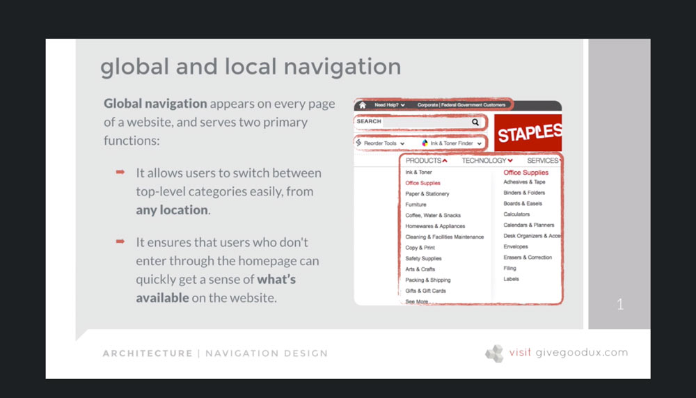

[Back to Course Outline](../README.md)  

[< Section 6](../notes/notes-section-06.md) | [Section 8 >](../notes/notes-section-08.md)  

# Section 7: Architecture: Creating a Solid Foundation Part III  <!-- omit in toc -->

### Table of Contents:  

- [58. Navigation Design](#58-navigation-design)
- [59. Primary and Secondary Navigation](#59-primary-and-secondary-navigation)
- [60. Global and Local Navigation](#60-global-and-local-navigation)
  - [Global navigation](#global-navigation)
  - [Local navigation](#local-navigation)
- [61. Navigation for Different User Types](#61-navigation-for-different-user-types)
- [62. Validating Your Navigation Scheme](#62-validating-your-navigation-scheme)
- [63. Exercise: Determining Key Navigation Paths](#63-exercise-determining-key-navigation-paths)
- [64. Wireframing 101](#64-wireframing-101)
- [65. What a Wireframe ISN'T](#65-what-a-wireframe-isnt)
- [66. What a Wireframe IS](#66-what-a-wireframe-is)
- [67. My Tips for Creating Successful Wireframe Prototypes](#67-my-tips-for-creating-successful-wireframe-prototypes)
- [68. Creating Wireframes: Tools of the Trade](#68-creating-wireframes-tools-of-the-trade)
- [69. SNACK BREAK: Try Creating a Basic Wireframe on Your Own](#69-snack-break-try-creating-a-basic-wireframe-on-your-own)
- [70. Exercise: Creating a B2B Wireframe with Axure RP Pro](#70-exercise-creating-a-b2b-wireframe-with-axure-rp-pro)
- [71. Socializing and Validating Wireframes](#71-socializing-and-validating-wireframes)
- [72. Architecture Takeaways: Things to Remember](#72-architecture-takeaways-things-to-remember)

# 58. Navigation Design  

Introduction: Getting from here to there and back again

[TOC](#Table-of-Contents)  

# 59. Primary and Secondary Navigation  

  
  

[TOC](#Table-of-Contents)  

# 60. Global and Local Navigation  

## Global navigation
  

## Local navigation
  

[TOC](#Table-of-Contents)  

# 61. Navigation for Different User Types  

Logged out  

  

Logged in  

  

  

- know how many user levels exist
- design and plan for each level separately
- detail content differences for users
- focus on context of use

[TOC](#Table-of-Contents)  

# 62. Validating Your Navigation Scheme  

[TOC](#Table-of-Contents)  

# 63. Exercise: Determining Key Navigation Paths  

[TOC](#Table-of-Contents)  

# 64. Wireframing 101  

[TOC](#Table-of-Contents)  

# 65. What a Wireframe ISN'T  

[TOC](#Table-of-Contents)  

# 66. What a Wireframe IS  

[TOC](#Table-of-Contents)  

# 67. My Tips for Creating Successful Wireframe Prototypes  

[TOC](#Table-of-Contents)  

# 68. Creating Wireframes: Tools of the Trade  

[TOC](#Table-of-Contents)  

# 69. SNACK BREAK: Try Creating a Basic Wireframe on Your Own  

[TOC](#Table-of-Contents)  

# 70. Exercise: Creating a B2B Wireframe with Axure RP Pro  

[TOC](#Table-of-Contents)  

# 71. Socializing and Validating Wireframes  

- [Wireframe Presentation Script]()
- [Wireframe Signoff Template]()

# 72. Architecture Takeaways: Things to Remember  

[Table of Contents](#Table-of-Contents:)  

[Back to Course Outline](../README.md)  

[< Section 6](../notes/notes-section-06.md) | [Section 8 >](../notes/notes-section-08.md)  
