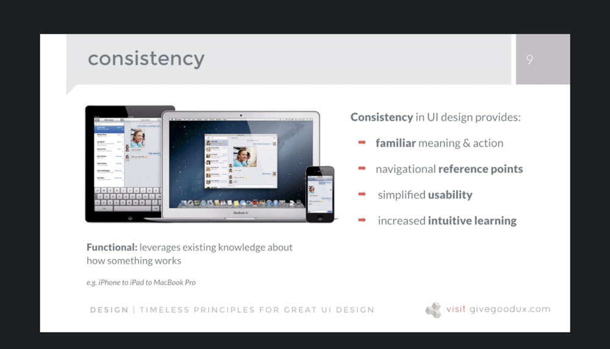

[Back to Course Outline](../README.md)  

[< Section 7](../notes/notes-section-07.md) | [Section 9 >](../notes/notes-section-09.md)  

# Section 8: Design: Information, Interaction and Interface  <!-- omit in toc -->

### Table of Contents:  

- [73. "What's It Gonna Look Like?" An Introduction to Design](#73-%22whats-it-gonna-look-like%22-an-introduction-to-design)
- [74. Defining Appropriate User Interface (UI) Design](#74-defining-appropriate-user-interface-ui-design)
  - [Appropriate UI design](#appropriate-ui-design)
  - [Better urban planning](#better-urban-planning)
    - [1) Defy the generic](#1-defy-the-generic)
      - [TAKEAWAY: If no one hates your website, **no one loves it either**](#takeaway-if-no-one-hates-your-website-no-one-loves-it-either)
      - [TAKEAWAY: A widespread style trend is not proof that it's the best or most intuitive idea for your UI - **it means most people imitate instead of innovate.**](#takeaway-a-widespread-style-trend-is-not-proof-that-its-the-best-or-most-intuitive-idea-for-your-ui---it-means-most-people-imitate-instead-of-innovate)
    - [2) Audience first.](#2-audience-first)
      - [Users](#users)
      - [Viewers](#viewers)
      - [Readers](#readers)
    - [3) Brand matters.](#3-brand-matters)
- [75. How Definition and IA Inform UI Design](#75-how-definition-and-ia-inform-ui-design)
  - [Revisit your strategy](#revisit-your-strategy)
  - [IA = information priority](#ia--information-priority)
  - [Takeaway:](#takeaway)
- [76. Timeless UI Design Principles, Part 01](#76-timeless-ui-design-principles-part-01)
  - [Affordance](#affordance)
  - [Closure](#closure)
  - [Consistency](#consistency)
- [77. Timeless UI Design Principles, Part 02](#77-timeless-ui-design-principles-part-02)
  - [Continuation](#continuation)
  - [Face-ism ratio](#face-ism-ratio)
  - [Enclosure](#enclosure)
  - [Figure-ground relationship](#figure-ground-relationship)
  - [Similarity](#similarity)
- [78. Timeless UI Design Principles, Part 03](#78-timeless-ui-design-principles-part-03)
  - [Fitt's law](#fitts-law)
  - [Occam's razor](#occams-razor)
  - [Hick's law (8:48 - lecture 78)](#hicks-law-848---lecture-78)
- [79. Timeless UI Design Principles, Part 04](#79-timeless-ui-design-principles-part-04)
- [80. SNACK BREAK: Identify Design Principles in an Existing UI](#80-snack-break-identify-design-principles-in-an-existing-ui)

# 73. "What's It Gonna Look Like?" An Introduction to Design  

**Appropriate** Visual Communication  

- **expectations** are first formed **visually**  
- audience-appropriate: users, readers, or viewers?  
- clear interaction cues  
- visual brand differentiation  

[TOC](#Table-of-Contents)  

# 74. Defining Appropriate User Interface (UI) Design  

visual design => visual language

## Appropriate UI design  

The most important role of the UI is to **encourage** the visitor to find out what's beyond that first screen. And if you do get them in the door, you can't **confuse** or **frustrate** them.  

Appropriate UI design enables visitors to do **what they came to do, what they _want_ to do**.  

It's no wonder that Google has had such monstrous success while surrounded by millions of sites that have failed: **its compass is often worth more than the land** it helps us navigate.  

## Better urban planning

In order for your UI Design to be **appropriate**, three things have to happen:  

1) It cannot be **generic**.
2) It has to be informed by the **type of audience** who will use the website.
3) It should represent your (or your client's) **brand identity**.

### 1) Defy the generic

With media overload at an all time high, dull, generic interactive experiences are all around us:  

- Thousands of apps that are all essentially **variations on a single idea.**
- Repsonsive websites that **all use the same basic visual template**.
- Social media sites all **essentially providing the same service** while calling it something different.  

#### TAKEAWAY: If no one hates your website, **no one loves it either**  

Generic UI design is easy, but it's unmemorable. And unmemorable means quickly forgotten and abandoned. Question your conventions:  
- Is your background always white?
- Do you always use horizontal navigation?
- Do you always use an image carousel on the home page?
- Do you sacrifice navigation cues for content in the name of "flat" design?

#### TAKEAWAY: A widespread style trend is not proof that it's the best or most intuitive idea for your UI - **it means most people imitate instead of innovate.**  

### 2) Audience first.  

**Trying to be everything to everybody rarely works.** Is it an entertaining blog, an impartial resource or a glorified sales brochure?  

**The Web isn't software, or TV, or print, but it functions in similar ways.** That function (and form) depends entirely on who it's for - users, viewers, or readers.  

#### Users  

- **Clear navigation and text:** things should be plainly marked and easily understood.  
- **Users have no patience for digression,** or for multi-tiered layers that stand between them and the information they seek.
- **Users expect sites to load quickly,** to accomodate any kind of device or connection, and to use the most broadly compatibile web technologies.  

#### Viewers  

- **Viewers want to be surprised, seduced, led along a path.** Their goal is the journey, not the end result.
- **Animation, motion, and video** are both desired and expected.
- **Even when the subject is business, the audience may be made up of viewers.** Black negative shows off its work with an animated UI: blacknegative.com/#!/bose/
  - that site is ***NOT*** very intuitive
    - locked out of navigation
    - auto play music

#### Readers  
- **Readers turn to a web site as they might turn to a novel or magazine article.** They expect and want to invest time.
- **Visual cues in the UI should signal ROI.**
  - [Medium.com](https://medium.com/) shows estimated time it will take the viewer to read an article.  
- **Blogs are for readers.**
  - Lots of negative space, large fonts, frequent paragraph and page breaks to ease eye strain.  

### 3) Brand matters.  

- **Your UI has to be as uniquely _you_ as it can be.** In content, presentation, and navigation.
- **If I can replace the logo on your site with someone else's** - and everything still works together visually and verbally - your UI design is generic.
- **Building an unique, memorable visual brand identity is one way smaller organizations get larger.** It's also how the larger ones stay on top.  

Your website - in form, content, and funtction - must **communicate your brand identity:**
- What does this person, product, or service do that makes it so **different**?
- What has this organization done lately that makes it **stand out**?
- What is your greatest and clearest **strength**?
- Why should anyone **care**?  

[TOC](#Table-of-Contents)  

# 75. How Definition and IA Inform UI Design  

## Revisit your strategy  

  

## IA = information priority  

  
  

## Takeaway:  

Every UI decision you make should provide **visible evidence of value.**

[TOC](#Table-of-Contents)  

# 76. Timeless UI Design Principles, Part 01  

## Affordance
- **Physical characteristics** of an element suggest and influence how it's used.
- Onscreen this is **purely visual** - buttons and fields, for example. 
- It should be **inconceivable** that the design could function or be used any other way.
- Design individual elements - and the app or site as a whole - to **afford intended function** and **discourage improper use.**

  
  

## Closure  

When an object is **incomplete** - but enough of it is indicated - the mind percieves the object to be whole by **mentally filling the information.**

  
  

  
  

## Consistency  

Usability is improved when similar parts are expressed in similar ways. Consistency in aesthetic style & appearance:  

- enhances **recognition**  
  

- communicates **membership**  
  

- sets emotional **expectation**  
  

- establishes & reinforces unique identity  
  

**Functional** consistency
  

Good:  
  

Not Good: "death by a thousand cuts"  
  

[TOC](#Table-of-Contents)  

# 77. Timeless UI Design Principles, Part 02  

## Continuation  

  
  

## Face-ism ratio  

- ratio of **face-to-body** in an image influences the way the person in the image is perceived.  
- face focuses attention on **intellectual** and **personality** attributes.  
- body focuses attention on **physical** and **sensual** attributes.  

  
  

  
  

## Enclosure  

Things that appear to have a boundary around them ar perceived to be **grouped** - and therefore **related** (e.g. Twitter's UI).  

  

## Figure-ground relationship  

- **figure:** definite shape, close
- **ground:** shapeless, far  
- stable relationship focuses **attention**  
- minimizes perceptual **confusion**  
- increases **recognition** of key elements  
- ambiguous relationships make bad communication design!  

  
  

- **transparent, darker background** de-emphasizes existing content.  
- **contrast** between modal window color and darker transparent background.
- manipulating the **figure-ground relationship** makes this workflow clear.

  

- Deiter Rams' **final principle** for good design states "as little design as possible."
- What's the **least amount of detail** that can be added to create the necessary impact?
- Applying Gestalt principles like figure-ground creates focus on the **essential meaning** in your UI.

  

## Similarity  
- Similar are perceived to be part of a **group** or **pattern**  
- Pinterest **entries** are all visually similar
- **Interaction patterns** for each entry are also similar.  

  
  
  

- Apple's app store

  

[TOC](#Table-of-Contents)  

# 78. Timeless UI Design Principles, Part 03  

## Fitt's law  
The time required to move to a target area (e.g. tap or click a button) is a function of:  
- **distance** to the target
- **size** of the target

  
  

## Occam's razor  
The **simplest** solution is usually the **best** solution:
- minimize cognitive effect
- **recognition** over recall
- make things look like what ehy are in **real life** (skeumorphism)

  

If you take this principle one step further, you keep the visual metaphor, but **simplify visual presentation.**   

  

In other words, you create **flat design**.

  
  
  
  
  

## Hick's law  (8:48 - lecture 78)

[TOC](#Table-of-Contents)  

# 79. Timeless UI Design Principles, Part 04  

[TOC](#Table-of-Contents)  

# 80. SNACK BREAK: Identify Design Principles in an Existing UI  

[TOC](#Table-of-Contents)  

[Back to Course Outline](../README.md)  

[< Section 7](../notes/notes-section-07.md) | [Section 9 >](../notes/notes-section-09.md)  
